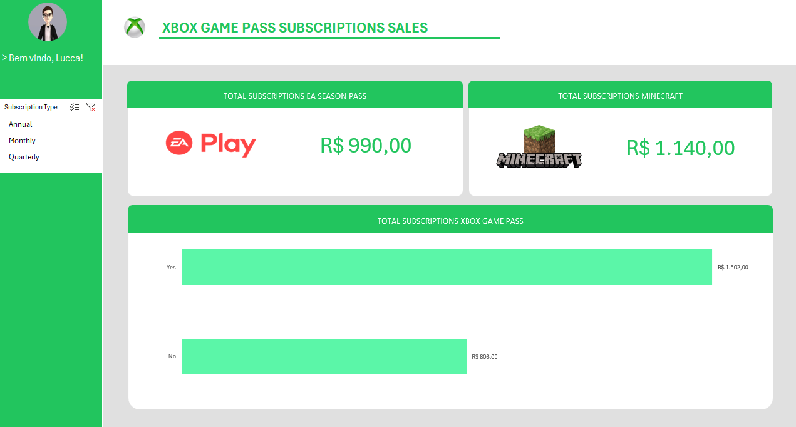

# 🎮 Xbox Sales Dashboard - Análise de Faturamento

 


## 📋 Sobre o Projeto

Este repositório contém um projeto de **Dashboard de Vendas no Excel**, focado na organização, tratamento e visualização de dados financeiros de assinaturas do ecossistema Xbox.

O objetivo principal foi analisar o faturamento proveniente dos planos de assinatura (Game Pass/Live Gold), receitas acessórias de *Add-ons* (EA Play e Minecraft Season Pass) e o impacto de cupons de desconto no valor final.

---

## 📊 Dashboard Desenvolvido

</img>

---

## 🗂️ Dicionário de Dados

A base de dados utilizada (`Base_Dados`) contém registros transacionais com os seguintes atributos:

| Atributo | Descrição |
| :--- | :--- |
| **Subscriber ID** | Identificador único do assinante. |
| **Name** | Nome do cliente. |
| **Plan** | Plano principal (ex: Ultimate, PC, Console). |
| **Start Date** | Data de início da vigência. |
| **Auto Renewal** | Status da renovação automática (`Yes`/`No`). |
| **Subscription Price** | Valor base do plano principal. |
| **Subscription Type** | Categoria da assinatura (ex: Mensal, Anual). |
| **EA Play Season Pass** | Contratação do serviço EA Play (`Yes`/`No`). |
| **EA Play Season Pass Price** | Valor adicional do EA Play. |
| **Minecraft Season Pass** | Contratação do passe Minecraft (`Yes`/`No`). |
| **Minecraft Season Pass Price** | Valor adicional do Minecraft. |
| **Coupon Value** | Valor do desconto aplicado. |
| **Total Value** | Valor final da transação *(Calculado)*. |

---

## ⚙️ Metodologia

O projeto foi desenvolvido no **Microsoft Excel** seguindo estas etapas:

### 1. Tratamento de Dados (ETL)
* Limpeza de dados e formatação de tipos (Moeda, Data).
* Criação de coluna calculada para `Total Value`:
  > *Fórmula: (Subscription Price + EA Play Price + Minecraft Price) - Coupon Value*

### 2. Indicadores (KPIs)
* **Faturamento Total Bruto:** Soma consolidada das receitas.
* **Ticket Médio:** Valor médio gasto por assinante.
* **Penetração de Add-ons:** Análise de adesão aos serviços extras (EA/Minecraft).
* **Churn Risk:** Análise baseada na coluna `Auto Renewal`.

### 3. Visualização
O dashboard inclui:
* **Slicers (Filtros):** Para segmentação dinâmica por plano e tipo de renovação.
* **Gráficos de Distribuição:** Receita por tipo de plano.
* **Comparativos:** Impacto dos Add-ons no faturamento total.

---

### 🛠️ Nota Técnica: Personalização da Modelagem
**O Desafio:**
A base original tratava o atributo `Total Value` como um dado estático (número fixo). Isso limitava a interatividade, pois o gráfico não recalculava a receita líquida corretamente ao tentar isolar produtos específicos.

**A Solução:**
Refatorei a coluna de valor total, substituindo os valores estáticos por uma fórmula estruturada dinâmica.

**Fórmula Implementada:**
```excel
=SOMA([@[Subscription Price]];[@[EA Play Season Pass Price]];[@[Minecraft Season Pass Price]])-[@[Coupon Value]]
```

---

## 🚀 Como Utilizar

1. **Download:** Baixe o arquivo `.xlsx` deste repositório.
2. **Abrir:** Abra o arquivo no Microsoft Excel (Recomendado: Versão 2016 ou superior).
3. **Atualizar:** Caso modifique a aba de dados, vá em `Dados > Atualizar Tudo` para processar as mudanças no Dashboard.


---
**Desenvolvido por:** Lucca de Sena Barbosa